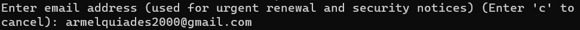

# Instalação da certificação SSL/TLS (HTTPs)

Nessa instalação, usaremos o certbot, que é um bot construido com python pela empresa Let's Encrypt

### Pré-requisitos

- Ubuntu 18.04
- Instalação do apache2
- Configuração de domínio do apache2

## Passos

*Observação: Os comandos devem ser executados como root, ou seja sudo.*

1. Instalar o certbot:

**apt-get install certbot python3-certbot-apache**

1. Inserir um email para a chegada dos logs e erros.

1. Concordar com os passos, digitando "**a**" e, logo em seguida, "**y**".

1. Nesse passo, o certbot deve listar todos os domínios configurados no servidor, perguntando quais o usuário deseja instalar as certificações.
    
    Para instalar em todos os domínios, é só deixar em branco.
    
    
    

1. O Último passo é somente forcar o uso do HTTPs, digitando "**2**".

1. Pronto, certificações instaladas e HTTPs funcionando

1. Para renovar a certificação automaticamente a cada 3 meses, digite o seguinte comando

**echo "0 0,12 * * * root python -c 'import random; import time; time.sleep(random.random() * 3600)' && certbot renew" | sudo tee -a /etc/crontab > /dev/null**
